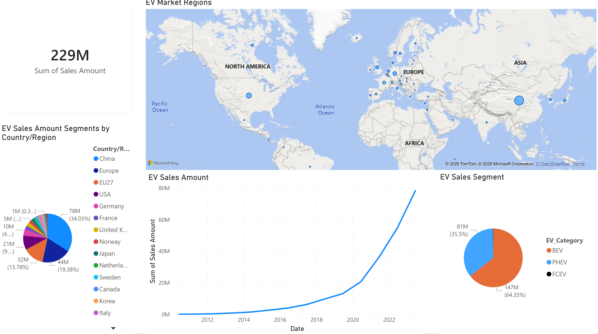
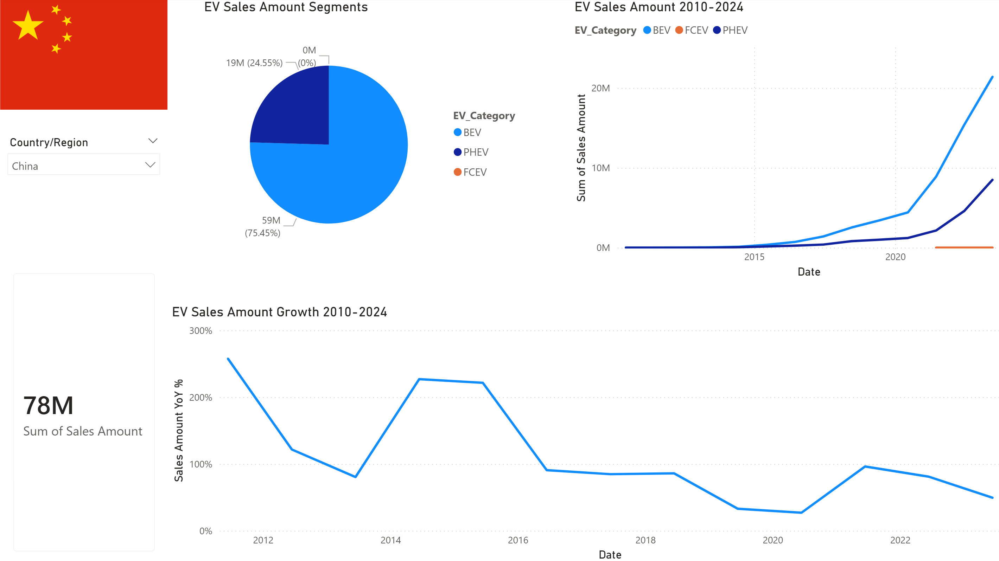
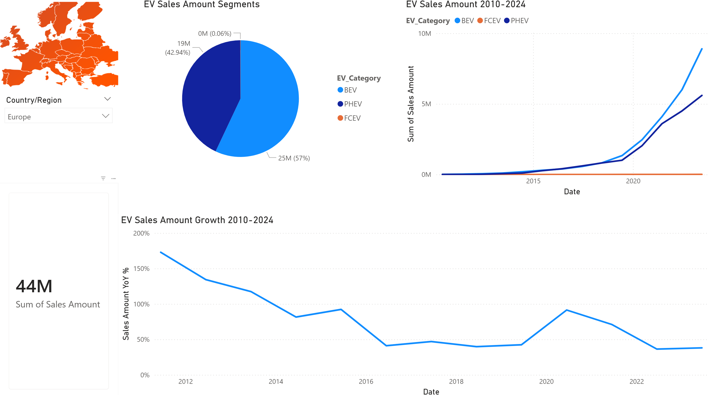
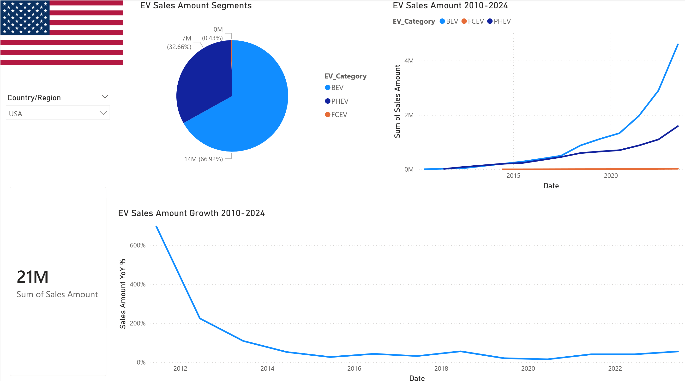

# worldwide-electric-vehicle-sales-analysis
Analyze the Worldwide Electric Vehicle historical sales data from IEA (International Energy Agency) and estimate the performance of main markets from different aspects

# Objectives
1. Introducing the world wide electric vehicle market performace
2. Overview the performance of main markets and other markets
3. Estimate and predict the future development of the main markets

# Screenshots of dashboard

